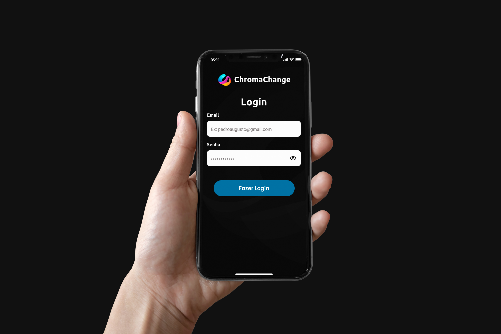

<div align="center">
  
</div>

<p align="center">🌈️ ChromaChange é um app para modificar as cores de elementos 3d, feito para o desafio Hand Talk</p>
<ul align="center">
    
    
</ul>

<h1>Conteúdo</h1>

* [Objetivo](#Objetivo)
* [Instalação](#Sobre)
* [Como usar](#como-usar)
* [Tecnologias](#tecnologias)

## 🎯 Objetivo
<p>Criar uma app que modifique as cores de 3 objetos 3d(cubo, cone e dodecaedro) e salve-os no firebase.</p>

## 🔧️ Instalação
<p>Primeiramente você precisará ter o expo-cli instalado globalmente, caso não tenha, execute</p>

```bash
npm install -g expo-cli
```

<p>Após isso clone este repositório</p>

```bash
git clone https://github.com/kingnaldoo/ChromaChange.git
```
<p>Em seguida instale as dependências</p>

```bash
yarn install
```

<p>Instaladas as dependências, execute a aplicação </p>

```bash
yarn start
```

## 🕹️ Como usar

<p>Para utilizar, baixe o app do expo go para  <a href="https://play.google.com/store/apps/details?id=host.exp.exponent&hl=pt_BR&gl=US" target="_blank"> Android</a> ou para <a href="https://apps.apple.com/br/app/expo-go/id982107779" target="_blank"> ios</a> e escaneie o QRCode do app</p>

<div>
<h3>Android</h3>

</div>
<div>
<h3>Ios</h3>

</div>

## 👾️ Tecnologias

<div align="center">


  


</div>

<h1> </h1>
<p align="center">Made with ❤ by <a href="http://www.codijr.ufc.br">Reinaldo da Silva</a></p>
